# TACo-ISP: Task-Aware, Closed-Loop HW/SW Co-Design of Image Signal Processing and DPU Inference for Real-Time Edge Vision

<p align="center">
  
  
  
  
  
  
</p>

---

## 📌 Tổng quan Đề tài

Trên các hệ thống SoC dị thể (Heterogeneous MPSoC), **nút cổ chai của thị giác máy tính biên thời gian thực không nằm ở DPU mà nằm ở đường truyền từ Cảm biến $\to$ Tensor**:
1. **Lãng phí băng thông & năng lượng:** Ảnh RAW đi qua ISP xử lý theo khung, ghi ra DDR, CPU đọc vào để resize/chuẩn hóa rồi lại ghi ra DDR cho DPU nạp vào (tốn $2 \sim 3$ vòng lặp qua bộ nhớ ngoài).
2. **Sai lệch mục tiêu thị giác:** ISP truyền thống được tinh chỉnh cho mắt người nhìn thay vì tối ưu cho đặc trưng học sâu của mạng nơ-ron (DNN).
3. **Thiếu khả năng thích nghi chi phí thấp:** Các giải pháp thích nghi hiện nay phải chạy một CNN phụ trợ tốn nhiều năng lượng để quan sát bối cảnh.

**TACo-ISP** giải quyết triệt để hai lớp bài toán:
- 🚀 **Hiệu năng hệ thống (Bài báo A):** Đưa toàn bộ ISP và tiền xử lý DNN thành một luồng trực tiếp `AXI4-Stream`, ghi thẳng vào bộ đệm tensor INT8 của DPU (**Zero-Copy Stream-to-Tensor**) qua địa chỉ vật lý của `VART RunnerExt`. CPU hoàn toàn giải phóng khỏi tác vụ tiền xử lý ảnh.
- 🎯 **Độ chính xác tác vụ & Thích nghi vòng kín (Bài báo B):** Tối ưu tham số ISP theo hàm mục tiêu phát hiện đối tượng qua một **"bản sao số" (Bit-Exact Differentiable Twin)** khớp bit 100% với phần cứng RTL, kết hợp **bộ điều khiển thích nghi vòng kín** chạy trên ARM Cortex-A53 điều chỉnh thanh ghi ISP từng khung hình dựa trên thống kê phần cứng và độ tin cậy từ DPU.

---

## 🎯 Chỉ tiêu Định lượng Kiểm chứng

| Chỉ tiêu khoa học | Mục tiêu đề tài | So với Baseline tham chiếu | Kiểm chứng qua |
| :--- | :---: | :---: | :---: |
| **Độ trễ Glass-to-Decision ($p99$)** | **Giảm $\ge 30\%$** | CPU-preproc + DPU (BA1) | LED quang + AXI Timer 64-bit |
| **Năng lượng mỗi khung hình (12V)** | **Giảm $\ge 20\%$** | BA1 ($mJ/\text{frame}$) | Mạch TI INA228 lấy mẫu 1 kHz |
| **Tải CPU cho tiền xử lý** | **$\approx 0\%$** | 1 lõi Cortex-A53 bão hòa (BA1) | Linux `top` / `sar` |
| **Độ chính xác mAP@0.5 ($\le 10$ lux)** | **Tăng $+5$ điểm** | ISP cố định cho mắt người (B0) | Tập dữ liệu KV-RAW-LUX |
| **Sai lệch Twin vs Phần cứng** | **$\le 0.3$ điểm mAP** | Mô hình dấu phẩy động | Chế độ Replay RAW từ DDR |
| **Thông lượng toàn chuỗi** | **$\ge 30$ FPS** | 1080p RAW10 đầu vào | Camera Sony IMX219 trực tiếp |

---

## 🏗️ Kiến trúc Phần cứng & Phần mềm (HW/SW Architecture)

```mermaid
flowchart TD
    subgraph PL["PL (FPGA Logic - 150 MHz / 300 MHz)"]
        direction TB
        CSI["MIPI CSI-2 RX (1080p RAW10)"] --> ISP["isp_top (HLS)\nBLC → DPC → NR → Demosaic → WB → CCM → Tone LUT"]
        ISP -->|AXI4-Stream RGB888| S2T["s2t_top (HLS - Stream-to-Tensor)\nResize song tuyến tính + Affine Quant INT8"]
        ISP -.->|80 từ thống kê| STATS["Thanh ghi Thống kê AXI4-Lite\n(Histogram, Noise, Sat_cnt)"]
        S2T ==>|AXI HP0 DMA Zero-copy| TBUF[("DPU Input TensorBuffer\n(DDR Physical Address)")]
        TBUF ==> DPU["DPU DPUCZDX8G v4.1 (B4096)\n300 MHz / DSP 600 MHz"]
        TIMER["AXI Timer 64-bit (100 MHz) + AXI GPIO"] -.->|Đồng bộ & LED| MEASURE["Hệ đo độ trễ / Năng lượng"]
    end

    subgraph PS["PS (ARM Cortex-A53 @ Linux 5.15-xilinx)"]
        direction TB
        T1["Luồng T1: Bắt ngắt S2T ap_done (UIO)"] --> T2["Luồng T2: VART execute_async (Zero-copy)"]
        T2 --> T3["Luồng T3: YOLOX Post-proc & NMS"]
        T3 -->|Phản hồi độ tin cậy DPU| T4["Luồng T4: Bộ điều khiển Thích nghi Vòng kín\n(< 0.5 ms/khung trên A53)"]
        STATS -.->|Đọc qua UIO| T4
        T4 -.->|Cập nhật thanh ghi ISP tại vsync| ISP
    end
```



---

## 📂 Cấu trúc Kho mã (Repository Structure)

```text
taco-isp/
├── hw/                          # PHẦN CỨNG PL (Vitis HLS C++, Vivado IPI, Link)
│   ├── hls/common/              # Hợp đồng số học cố định (taco_types.h) + host shim
│   ├── hls/isp/                 # ISP: BLC, DPC, NR, demosaic MHC, WB, CCM, LUT tone, thống kê
│   ├── hls/s2t/                 # Stream-to-Tensor zero-copy (s2t_top) & m2m baseline (s2t_m2m)
│   ├── hls/replay/              # Khối phát lại RAW từ DDR vào ISP (raw_mm2s)
│   ├── hls/tb/                  # Testbench C++ kiểm thử mức host (tb_host.cpp)
│   ├── hls/scripts/             # Kịch bản Vitis HLS (run_hls.tcl)
│   ├── vitis/                   # Cấu hình ghép hệ thống link.cfg, dpu_conf.vh
│   └── overlay/                 # Device-tree overlay UIO (taco.dtsi)
│
├── sw/                          # PHẦN MỀM PS (C++17, Linux Ubuntu 22.04 / PetaLinux 2022.2)
│   ├── common/                  # Driver userspace UIO (uio.hpp), đồng hồ AXI Timer (HwClock)
│   ├── app/                     # Ứng dụng P-TACo (taco_app.cpp), baseline BA1/BA2/BA3, yolox_post.hpp
│   ├── controller/              # Bộ điều khiển vòng kín C++ runtime (< 0.5 ms/khung)
│   └── CMakeLists.txt           # Build hệ thống C++17 liên kết VART/XIR/XRT/OpenCV
│
├── twin/                        # BẢN SAO SỐ KHẢ VI (Bit-Exact Digital Twin)
│   ├── params.py                # Lớp cấu hình thanh ghi duy nhất, tính letterbox, quant_affine
│   ├── isp_ref.py, s2t_ref.py   # Bản tham chiếu vàng NumPy (Int64)
│   └── isp_twin.py              # PyTorch Twin khả vi hỗ trợ đạo hàm ngược (STE)
│
├── train/                       # HUẤN LUYỆN & MÔ HÌNH HỌC MÁY
│   ├── noise_calib.py           # Hiệu chuẩn mô hình nhiễu Poisson-Gauss cho Sony IMX219
│   ├── unprocess.py             # Sinh tập RAW tổng hợp từ COCO (D1)
│   ├── joint_train.py           # Huấn luyện đồng thời ISP + Detector qua Twin
│   ├── oracle.py                # Tìm tham số tối ưu cục bộ từng khung hình
│   └── controller.py            # Huấn luyện mạng MLP điều khiển và chưng cất tri thức
│
├── measure/                     # HỆ THỐNG ĐO LƯỜNG VẬT LÝ
│   ├── ina228_logger/           # Firmware MCU (ESP32) lấy mẫu công suất 12V ở 1 kHz
│   └── log_power.py             # Kịch bản ghi log năng lượng đồng bộ cổng serial và hwmon
│
├── experiments/                 # TỰ ĐỘNG HÓA THỰC NGHIỆM
│   ├── run_matrix.py            # Kịch bản chạy ma trận đo qua SSH, nghỉ nhiệt, ghi ENV.md
│   └── tn_a2.json               # Cấu hình ma trận thực nghiệm độ trễ và năng lượng
│
├── analysis/                    # PHÂN TÍCH DỮ LIỆU & XUẤT BẢN
│   ├── SCHEMAS.md               # Lược đồ chuẩn cho 9 bảng kết quả khoa học
│   ├── latency.py               # Phân tích phân rã độ trễ, block-bootstrap khối 300 khung
│   ├── energy.py                # Tích phân năng lượng mJ/khung, Welch t-test
│   ├── map_eval.py              # Đánh giá mAP COCO với bootstrap ghép cặp
│   ├── make_tables.py           # Tự động kết xuất 9 bảng Markdown & LaTeX (booktabs)
│   └── plots.py                 # Tự động sinh đồ thị PDF vector (F-A2 đến F-B5)
│
├── tables/                      # BẢNG KẾT QUẢ KHOA HỌC (T-A1 đến T-B5)
├── regs/                        # File nạp thanh ghi phần cứng (default.txt, tone_basis.txt)
├── tools/                       # Tiện ích sinh vector kiểm thử, demo results
├── tests/                       # 35 bài kiểm thử tự động (khớp bit, controller, pipeline)
└── results/                     # Dữ liệu thực nghiệm thực tế từ board KV260
    ├── raw/                     # Log thô từng khung, log công suất, ENV.md
    └── summary/                 # Tóm tắt số liệu 9 bảng khoa học
```

---

## 👥 Phân công Trách nhiệm Nhóm Nghiên cứu

| Thành viên | Trách nhiệm cốt lõi | Thư mục phụ trách chính | Đóng góp học thuật |
| :---: | :--- | :--- | :---: |
| **TV1** | **Phần cứng PL:** Thiết kế HLS ISP, Stream-to-Tensor, Vivado IPI, đóng timing, link DPU. | `hw/` | Đồng tác giả chính **Bài báo A** |
| **TV2** | **Phần mềm PS & Đo lường:** Runtime C++17, VART zero-copy, đo độ trễ glass-to-decision, đo công suất 12V INA228, xử lý số liệu Bài A. | `sw/`, `measure/`, `experiments/`, `analysis/` | Đồng tác giả chính **Bài báo A** |
| **TV3** | **AI & Dữ liệu:** Thu thập dataset RAW, twin PyTorch khớp bit, huấn luyện joint ISP-DPU, bộ điều khiển thích nghi. | `twin/`, `train/` | Tác giả chính **Bài báo B** |

---

## ⚡ Bắt đầu Nhanh (Quick Start)

### 1. Cài đặt môi trường trên máy tính cá nhân (Host)
```bash
# Tạo môi trường ảo và cài đặt thư viện
python -m venv .venv
source .venv/bin/activate  # Trên Windows: .venv\Scripts\activate
pip install -r requirements.txt
```

### 2. Chạy bộ kiểm thử khớp bit tự động
```bash
# Kiểm tra khớp bit tuyệt đối giữa C++ HLS, NumPy và PyTorch (35 bài test)
make test

# Chạy nhanh bỏ qua khung hình 1080p đầy đủ
make test-fast
```

### 3. Sinh file thanh ghi mặc định
```bash
make regs
```

### 4. Kết xuất bảng biểu và đồ thị bài báo
```bash
# Tự động xuất 9 bảng LaTeX và Markdown vào tables/out/
make tables

# Tự động vẽ đồ thị PDF vector vào figs/
make figs
```

---

## 🔬 Nguyên tắc Vàng về Tính Tái lập (Reproducibility)

1. **100% Số liệu thật từ phần cứng:** Mọi số liệu trong bài báo bắt buộc phải được xuất từ board AMD Kria KV260 thông qua `analysis/make_tables.py`. Tuyệt đối không đưa số liệu từ `results_demo/` vào bản thảo.
2. **Hợp đồng Khớp bit (Bit-exact Contract):** Bất kỳ chỉnh sửa nào tại phần cứng HLS (`hw/hls/`) phải được cập nhật đồng thời tại `twin/` và vượt qua toàn bộ 35 bài test (`make test`).
3. **Không chỉnh sửa thanh ghi bằng tay:** Toàn bộ cấu hình thanh ghi nạp xuống KV260 phải được sinh tự động từ `twin/params.py` hoặc `tools/make_default_regs.py`.
4. **Khóa môi trường thực nghiệm:** Cố định phiên bản Vivado/Vitis 2022.2, Vitis AI 3.0 và lưu mã hash SHA-256 của SD image trong file `ENV.md` cho mỗi đợt đo.

---

## 📄 Mục tiêu Xuất bản

1. **Bài báo A (Nộp Tuần 40):** *A Task-Aware, Zero-Copy Stream-to-Tensor Pipeline for Real-Time Edge Vision on MPSoC* — Đích nhắm: **Springer Journal of Real-Time Image Processing (JRTEP)**.
2. **Bài báo B (Nộp Tuần 62):** *Closed-Loop Hardware-in-the-Loop Adaptive ISP for Edge Object Detection under Dynamic Lighting* — Đích nhắm: **IEEE Transactions on Circuits and Systems for Video Technology (TCSVT)**.
